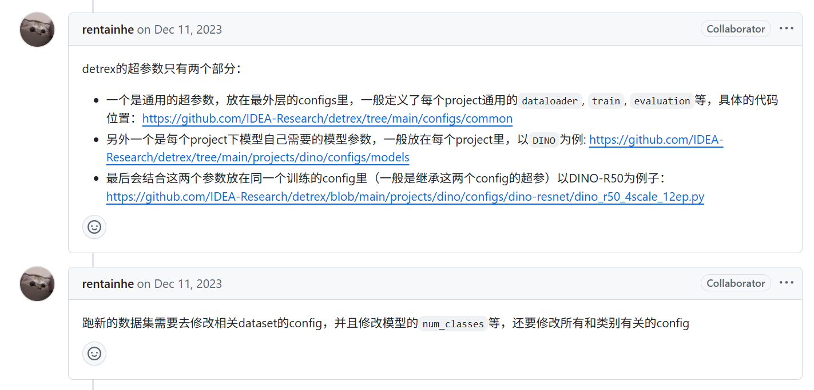

权重都在/mnt/data/kky/checkpoint

```shell
python tools/train_net.py --config-file projects/dino/configs/dino-resnet/dino_r50_4scale_12ep_better_hyper.py
```

超参数设置 https://github.com/IDEA-Research/detrex/issues/326#issuecomment-1849241997



```shell
# 在启动时设置不同的环境变量指定不同的显卡

# 在 GPU 0 上运行，使用 config1.yaml
CUDA_VISIBLE_DEVICES=0 python train_net.py --config-file config1.yaml

# 在 GPU 1 上运行，使用 config2.yaml
CUDA_VISIBLE_DEVICES=1 python train_net.py --config-file config2.yaml

# 多视角启动命令
python demo/demo.py --config-file projects/dino/configs/dino-resnet/dino_r50_4scale_12ep_better_hyper.py --multi_view_input "./inputs"  --metadata_dataset shampoo_train_datasets --opts train.init_checkpoint="/mnt/data/kky/output/dino_r50_4scale_12ep_better_hyper/model_0089999.pth"
```

1. 支持每组文件夹的数量不一致，但一定要有一张ref_参考帧
2. 运行模型得到一组预测结果后，先可视化参考帧单视角的识别结果
3. 获取每个视角的预测框的中心点坐标，然后将其他视角的中心点坐标对齐到参考帧坐标
    1. 使用SIFT特征检测方法进行对齐, 当对齐质量很差时就忽略这个视角不参与处理。这里阈值设置的较高，很可能会只剩参考帧一帧。
4. 对一组识别结果进行网格化处理，网格大小设置为100, 网格内保存[score, class_id, bbox]
5. 综合多个视角的网格化数据
